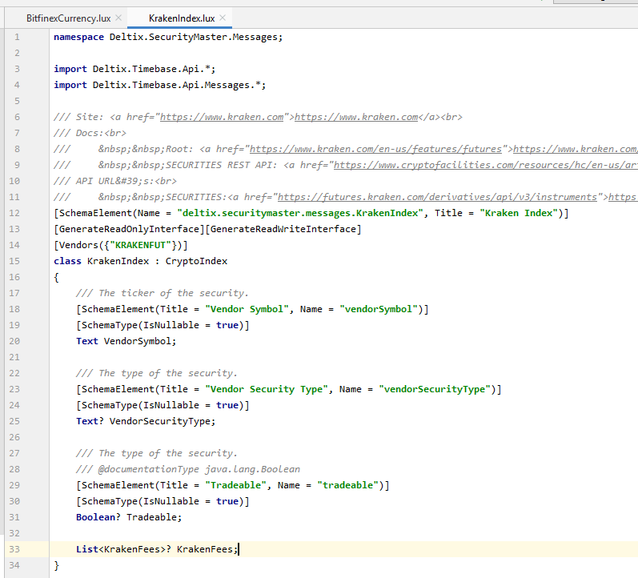

# Luminary JetBrains Plugin

Plugin for highlighting, refactoring, etc. for Luminary language.

Download: https://packages.deltixhub.com/assets/Test.Assets/LuminaryJetBrains/0.0.1/

Install:
1. Download zip archive.
2. Open any JetBrains IDE.
3. Use File->Settings->Plugins->Install from disk to install (in lastest versions you have to click 'Settings' icon in Plugins section to see 'Install from disk' options).

For now performs only highlighting like this:

